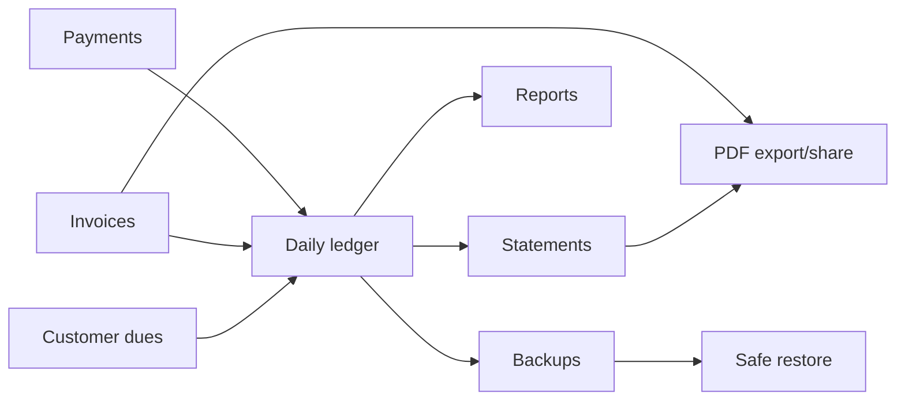
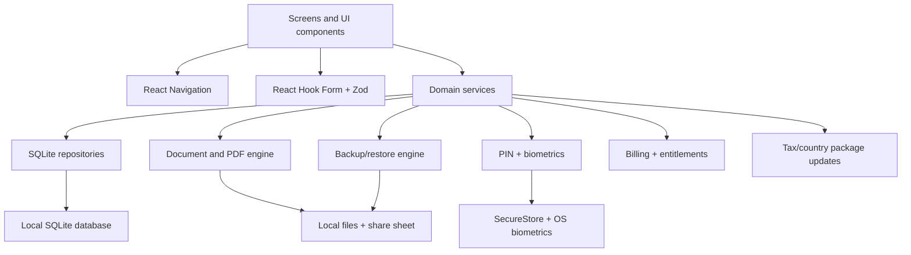
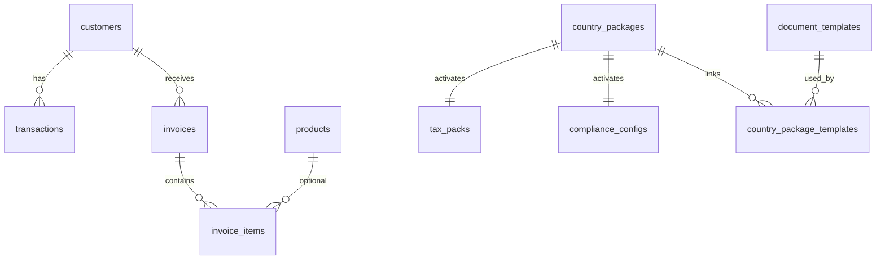
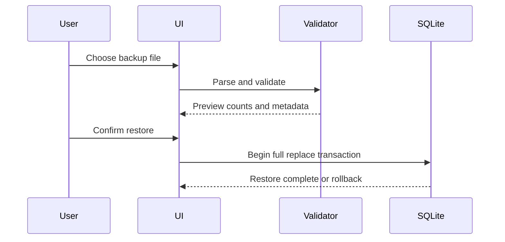

# Orbit Ledger by Rudraix

<p align="center">
  
</p>

<h3 align="center">Offline-first business ledger, invoices, statements, backups, and local trust tools for small businesses.</h3>

<p align="center">
  <strong>Fast enough for counter use.</strong><br />
  <strong>Clear enough for non-technical users.</strong><br />
  <strong>Serious enough for real business records.</strong>
</p>

<p align="center">
  
  
  
  
</p>

---

## The Vision

Orbit Ledger is built for shopkeepers, vendors, freelancers, service providers, and small business owners who need to answer three questions quickly:

1. Who owes me money?
2. What do I need to record now?
3. Can I trust my data and documents?

The app is designed as a **fast business command center**, not a generic CRUD app. Core ledger work is local-first, private, and available without a backend.



---

## Product Snapshot

| Area | What Orbit Ledger Offers |
| --- | --- |
| Ledger | Customers, credit/payment entries, balances, transaction history |
| Documents | Customer statements and invoices with PDF preview, save, print, and share |
| Offline Storage | Local SQLite database, no cloud backend required for core use |
| Backup | Full app backup/export/restore with strict validation and preview |
| Security | 4-digit PIN, inactivity lock, sensitive action confirmation, biometric unlock |
| Tax Readiness | Local tax packs, invoice tax profile, country packages, remote update architecture |
| Inventory | Products, stock validation, low-stock warnings, invoice integration |
| Reports | Sales, dues, customer insights, compliance summaries |
| Monetization | Free/Pro feature gating, Play Billing product mapping, country pack purchases |
| Help | Offline Orbit Helper for app guidance |

---

## Why It Stands Out

Orbit Ledger focuses on ordinary business tasks done exceptionally well:

- **Fast transaction entry** for daily counter use.
- **Clear customer balance views** with credit/payment distinction.
- **Trustworthy backup and restore** for business-critical data.
- **Clean PDF previews** before sending statements or invoices.
- **Local-first privacy** with SQLite and device security.
- **Country/tax package readiness** without making simple ledger tracking complex.
- **Pro document polish** without blocking core ledger functionality.

---

## Feature Tour

### 1. Business Setup

Create the business identity used across the app and future documents.

- Business name and owner name
- Phone and email
- Structured address
- Currency, country, and region/state
- Company logo
- Authorized person name and designation
- Signature image
- Tax-ready profile metadata

### 2. Dashboard

The dashboard acts as the business command center.

- Total receivable
- Outstanding customers
- Today’s entries
- Recent activity
- Needs-attention signals
- Quick actions for customers, transactions, invoices, reports, backup, tax, and settings

### 3. Customer Ledger

Manage customers and dues with a clean offline ledger.

- Customer search and filters
- Add/edit/archive customers
- Opening balance
- Credit and payment entries
- Running balance
- Ledger history grouped for readability
- Statement generation from customer detail

### 4. Transactions

Built for speed.

- Credit or payment
- Amount, note, and date
- Native date picker
- Numeric keyboard for amount fields
- Edit existing transactions
- Balance recalculation after changes

### 5. Invoices

Invoice creation is independent from the ledger transaction table.

- Customer selection
- Multiple invoice items
- Item descriptions for products or services
- Quantity, price, tax rate, and total calculation
- Invoice edit flow
- Inventory-aware product picker
- Stock adjustment on invoice save/edit
- Invoice PDF preview, save, share, and print

### 6. Statements

Generate professional customer statements.

- Date filters
- Quick ranges
- Transaction table
- Running balance
- Totals
- Business identity
- Customer identity
- Signature block
- PDF preview, save, share, print

### 7. Backup And Restore

Business data deserves serious handling.

- Structured JSON backup format
- Full current app dataset coverage
- Backup metadata and versioning
- Validation before restore
- Restore preview
- Full replace restore
- Transactional restore strategy
- Friendly failure states
- Clear security/PIN limitations

### 8. Security

Security is local and device-first.

- 4-digit PIN
- PIN hash stored securely, not plain text
- Inactivity timeout
- Lock on launch and after background timeout
- Rate limiting for failed PIN attempts
- Sensitive action confirmation
- Face ID / fingerprint unlock through the device OS
- PIN remains the fallback

> Biometric data never enters Orbit Ledger. The operating system performs the biometric check locally and only returns success or failure.

### 9. Tax, Country Packages, And Compliance

Orbit Ledger is prepared for country-aware business logic without forcing it into simple ledger use.

- Tax profiles
- Tax packs
- Country packages
- Dynamic document templates
- Compliance configuration
- Remote update provider architecture
- HTTPS and checksum validation for remote payloads
- Offline use after successful install/update

### 10. Monetization

Core ledger functionality stays available in the free tier.

- Free tier for daily ledger, customers, basic PDFs, backup/restore, and app lock
- Pro tier for enhanced documents, premium templates, and branding
- Android Play Billing integration through `expo-iap`
- Product mappings for Pro subscriptions and country packs
- Local entitlement cache derived from billing state

---

## System Architecture



### Project Structure

```text
src/
  accountant/        Accountant export services
  analytics/         Local usage analytics
  backup/            Backup format, validation, export, restore
  compliance/        Compliance report generation/export
  components/        Shared UI system
  countryPackages/   Country package lifecycle and updates
  database/          SQLite schema, repositories, mappers
  documents/         Statements, invoices, PDF rendering
  engagement/        Rating, feedback, referral, retention nudges
  forms/             Shared form validation and address helpers
  mapping/           Data mapping between business modules
  monetization/      Pro plans, billing, gating, nudges
  navigation/        App navigation
  orbitHelper/       Offline helper content and service
  screens/           App screens
  security/          PIN, biometrics, screen privacy
  sync/              Future sync metadata interfaces
  tax/               Tax profiles, packs, rate resolver
  theme/             Brand, colors, spacing, typography
  updates/           Remote update contract and trust helpers
```

---

## Data Model Highlights

Orbit Ledger uses local SQLite tables for:

- Business settings
- Customers
- Transactions
- App security state
- Invoices and invoice items
- Products
- Tax profiles and tax packs
- Document templates
- Compliance configs and reports
- Country packages and package-template links
- App preferences, feature toggles, analytics, subscription status
- Generated document history



---

## Technology Stack

| Layer | Choice |
| --- | --- |
| Framework | Expo + React Native |
| Language | TypeScript |
| Navigation | React Navigation native stack |
| Forms | React Hook Form |
| Validation | Zod |
| Database | Expo SQLite |
| Secure Storage | Expo SecureStore |
| Biometrics | Expo Local Authentication |
| PDF | Expo Print + local file handling |
| Sharing | Expo Sharing |
| Billing | Expo IAP |
| Styling | Local design system tokens and reusable components |

---

## Getting Started

### 1. Clone The Repository

```bash
git clone git@github.com:mehtabhaumik/OrbitLedger.git
cd OrbitLedger
```

If your folder is named with a space locally:

```bash
cd "/Users/bhaumikmehta/Downloads/Orbit Ledger"
```

### 2. Install Dependencies

```bash
npm install
```

### 3. Run TypeScript Check

```bash
npx tsc --noEmit
```

### 4. Start Expo

```bash
npm run start
```

### 5. Run On Android

```bash
npm run android
```

For complete native feature testing, prefer a development build or Play testing build instead of Expo Go.

### 6. Run On iOS

```bash
npm run ios
```

For physical iPhone testing with native modules:

```bash
npx expo start --dev-client
```

Use an EAS development build when testing biometrics, billing, secure storage, PDF, and sharing behavior.

---

## Native Build Paths

### Android Internal / Preview Build

```bash
eas build --platform android --profile preview
```

### Android Production Build

```bash
eas build --platform android --profile production
```

### iOS Device Preview Build

```bash
eas build --platform ios --profile ios-device-preview
```

### iOS Production Build

```bash
eas build --platform ios --profile production
```

---

## Play Billing Setup

The Android billing QA guide is available here:

[docs/play-billing-test-readiness.md](./docs/play-billing-test-readiness.md)

Current product matrix:

| Product | Product ID | Type |
| --- | --- | --- |
| Pro Monthly | `com.rudraix.orbitledger.pro.monthly` | Subscription |
| Pro Yearly | `com.rudraix.orbitledger.pro.yearly` | Subscription |
| United States Country Pack | `com.rudraix.orbitledger.countrypack.us` | One-time product |
| United Kingdom Country Pack | `com.rudraix.orbitledger.countrypack.uk` | One-time product |

India is included by default in this phase and should not be configured as a paid country pack product.

---

## Remote Tax And Country Package Updates

The remote update contract is documented here:

[docs/remote-tax-package-update-contract.md](./docs/remote-tax-package-update-contract.md)

Production defaults:

```text
https://updates.orbitledger.rudraix.com/v1/tax-packs/manifest.json
https://updates.orbitledger.rudraix.com/v1/country-packages/manifest.json
```

Staging overrides:

```bash
EXPO_PUBLIC_ORBIT_LEDGER_TAX_PACK_MANIFEST_URL="https://staging.example.com/tax-packs/manifest.json"
EXPO_PUBLIC_ORBIT_LEDGER_COUNTRY_PACKAGE_MANIFEST_URL="https://staging.example.com/country-packages/manifest.json"
```

Remote payload acceptance requires:

- HTTPS URL
- supported schema version
- SHA-256 checksum match
- valid payload shape
- matching country/region/tax scope
- successful local validation before storage

---

## Backup And Restore Safety

Backup files are structured JSON documents with metadata, versioning, and strict validation.

Restore flow:



Important security note:

- Backup may include app lock status.
- Backup does not include the PIN.
- Backup does not include biometric unlock credentials or preferences.
- After restore, enable PIN and biometrics again on the device if needed.

---

## Security Model

| Protection | Behavior |
| --- | --- |
| PIN | 4-digit PIN, hashed with salt, stored in SecureStore |
| Rate limiting | Failed attempts are paused after repeated errors |
| Inactivity lock | User-selectable timeout |
| Sensitive actions | PIN or biometric confirmation when enabled |
| Biometrics | OS-level Face ID / fingerprint check, offline |
| Privacy | Sensitive screens can prevent capture where supported |

Biometric unlock is intentionally a convenience layer. PIN remains the fallback and source of truth.

---

## Design System

Orbit Ledger uses a calm, professional visual language:

| Meaning | Color Role |
| --- | --- |
| Primary action | Blue |
| Payment received | Green / teal |
| Credit / dues | Amber |
| Destructive actions | Controlled red |
| Tax / country intelligence | Blue-violet |
| Pro / premium | Magenta-violet |

Design principles:

- large tap targets
- clear hierarchy
- readable typography
- restrained color usage
- polished cards and status chips
- mobile-first spacing
- practical, non-flashy business UI

---

## QA Checklist

Before release testing, verify:

- Onboarding and business setup
- Logo and signature upload
- Dashboard summary cards
- Customer create/edit/archive
- Transaction add/edit
- Running balances
- Statement preview/export/share/print
- Backup export/preview/restore
- PIN enable/change/disable
- Biometric unlock
- Background/inactivity relock
- Invoice create/edit
- Invoice PDF preview/export/share/print
- Product inventory and stock adjustments
- Tax setup and tax pack update
- Country package unlock/install/switch/update
- Compliance report generation/export
- Accountant export
- Pro upgrade and feature gating
- Copy consistency across major flows

---

## Current Launch Notes

This repository contains the app implementation and launch preparation structure. Some production services still require external setup before public launch:

- Google Play products must be created and activated in Play Console.
- A signed Android build must be distributed through a Play testing track for billing QA.
- Remote tax/package update manifests must be hosted at reachable HTTPS URLs.
- iOS TestFlight and App Store setup require Apple Developer configuration.
- Store listing, privacy policy, content rating, screenshots, and Data Safety forms are outside the repo.

---

## Useful Commands

```bash
# Start Expo
npm run start

# Android
npm run android

# iOS simulator
npm run ios

# iOS simulator through localhost
npm run ios:local

# Clear iOS local Expo state
npm run ios:local:clear

# Web preview
npm run web

# TypeScript verification
npx tsc --noEmit

# Regenerate brand assets
npm run brand:assets
```

---

## Repository Status

Orbit Ledger is currently implemented as a local-first Expo app with modular services, SQLite persistence, document generation, backup/restore, PIN and biometric security, monetization scaffolding, Play Billing integration, remote tax/package update architecture, and polished business-oriented UI.

The next milestone is full device/runtime QA on Android and iOS with signed builds.

---

## Built For

Small businesses that need a practical app they can trust:

- shopkeepers
- traders
- service vendors
- repair businesses
- freelancers
- consultants
- local suppliers
- independent professionals

Orbit Ledger’s goal is simple: **help users record money clearly, protect their data, and share professional documents without depending on the cloud for daily work.**
